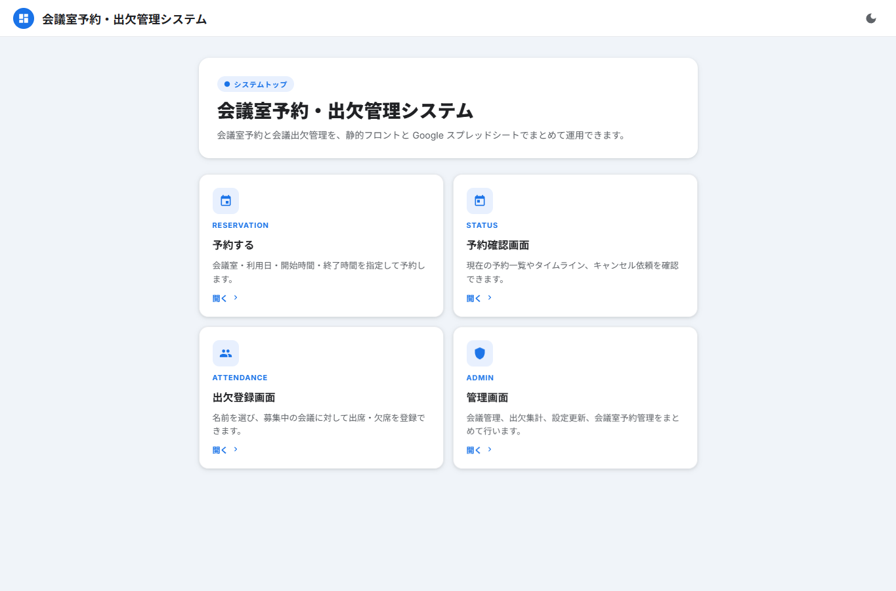
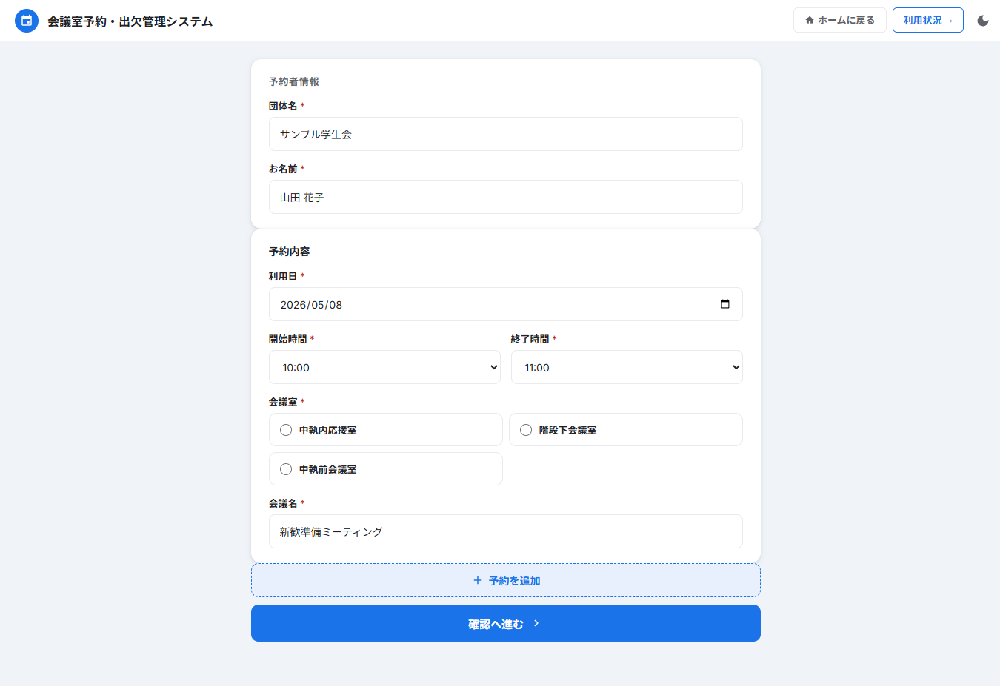
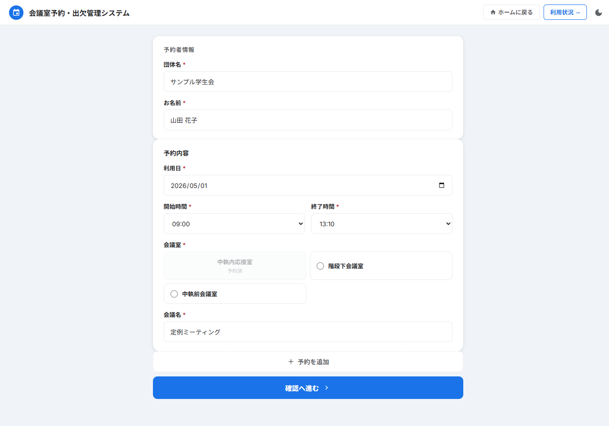
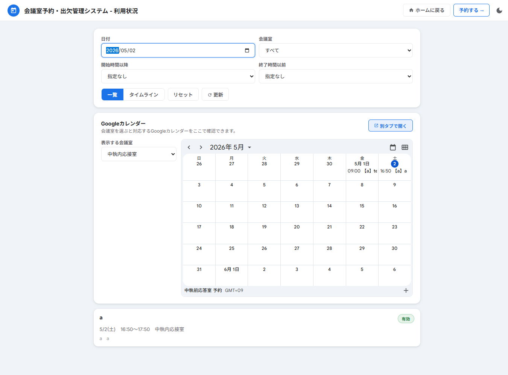
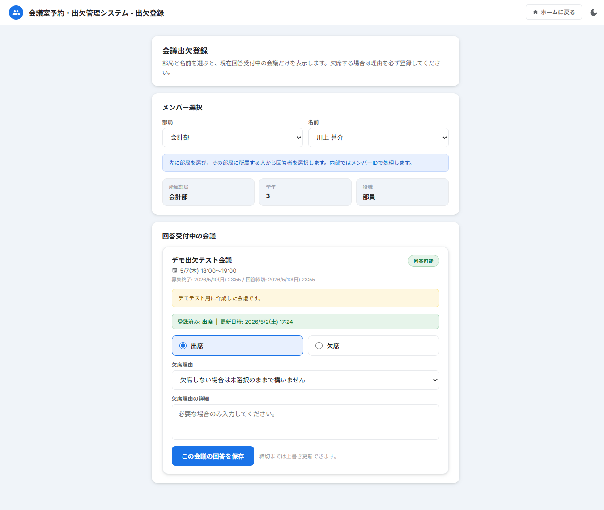
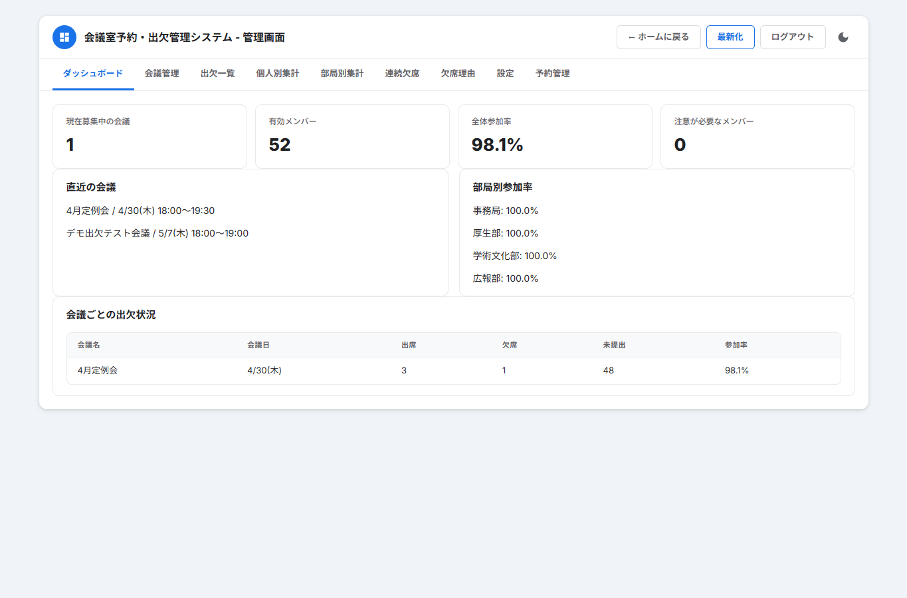

# 会議室予約・出欠管理システム 使いかた

この資料は、学生が実際に使う画面を中心にまとめた説明です。  
ブラウザでシステムを開き、トップ画面から使いたい機能を選びます。

## 1. 画面の選び方

トップ画面には、主に次の4つの入口があります。

| 入口 | 使う場面 |
|---|---|
| 予約する | 会議室を新しく予約したいとき |
| 予約確認画面 | 会議室の空き状況や予約済み時間を見たいとき |
| 出欠登録画面 | 会議への出席・欠席を回答したいとき |
| 管理画面 | 運営担当者が会議、設定、予約を管理するとき |

学生が普段使うのは、主に `予約する`、`予約確認画面`、`出欠登録画面` です。

## 2. 会議室を予約する

`予約する` を開き、団体名、お名前、利用日、開始時間、終了時間、会議名を入力します。

入力すると、その時間に使える会議室が表示されます。使いたい会議室を選んで、確認画面に進みます。

予約前に確認すること:

| 確認する内容 | 理由 |
|---|---|
| 利用日 | 日付間違いを防ぐため |
| 開始時間・終了時間 | 他の予約と重ならないようにするため |
| 会議室 | 使いたい部屋を間違えないため |
| 会議名 | 利用状況画面で見分けやすくするため |

入力が足りない場合は、画面にエラーが表示されます。エラーが出た項目を入力してから、もう一度確認に進んでください。

## 3. 予約済みの部屋を確認する

同じ時間にすでに予約が入っている部屋は、予約済みとして表示されます。

予約済みの部屋は選ばず、別の空いている部屋か別の時間を選んでください。

## 4. 予約状況を見る

`予約確認画面` では、日付や会議室で絞り込んで予約状況を確認できます。

見られる内容:

| 表示 | 内容 |
|---|---|
| 一覧 | 予約されている会議名、時間、会議室、団体名 |
| タイムライン | 時間帯ごとの予約状況 |
| カレンダー | 会議室ごとの Google カレンダー表示 |

予約を入れる前に、先にこの画面で空き状況を確認しておくと間違いが少なくなります。

## 5. 出欠を登録する

`出欠登録画面` を開き、自分の部局と名前を選びます。

名前を選ぶと、自分の情報と受付中の会議が表示されます。会議ごとに `出席` または `欠席` を選んで保存します。

欠席するとき:

| 状況 | 入力する内容 |
|---|---|
| 授業で欠席 | 欠席理由で `授業` を選ぶ |
| 体調不良で欠席 | 欠席理由で該当する理由を選ぶ |
| 選択肢にない理由 | `その他` を選び、詳細理由を書く |

`その他` を選んだ場合は、詳細理由を入力しないと保存できません。  
運営設定によっては、`授業` などを選んだ場合でも詳細理由が必要になることがあります。

## 6. 回答を変更する

一度保存したあとでも、受付期間内であれば同じ画面から回答を変更できます。

変更方法:

1. 出欠登録画面を開く。
2. 自分の部局と名前を選ぶ。
3. 対象の会議で回答を選び直す。
4. 保存する。

同じ会議に対して保存し直すと、前の回答が新しい回答に置き換わります。

## 7. 運営担当者向け

管理画面は、会議や予約、出欠集計を管理する担当者だけが使います。

管理画面でできること:

| 機能 | 内容 |
|---|---|
| 会議管理 | 出欠を取る会議の追加・変更・無効化 |
| 出欠一覧 | 学生ごとの回答確認 |
| 集計 | 会議ごとの出席・欠席人数の確認 |
| 設定 | 欠席理由の入力ルールなどの変更 |
| 予約管理 | 会議室予約の確認・取消 |

会議の削除は、データを完全に消すのではなく、無効化して学生画面に出さない運用です。

## 8. 困ったとき

| 状況 | 対応 |
|---|---|
| 予約できない | 必須項目がすべて入力されているか確認する |
| 会議室が選べない | その時間に予約済みの可能性があるため、時間か部屋を変える |
| 出欠を保存できない | 欠席理由や詳細理由が必要か確認する |
| 自分の名前が出ない | 部局の選択が合っているか確認する |
| 予約がすぐ表示されない | 数秒待ってから画面を更新する |

