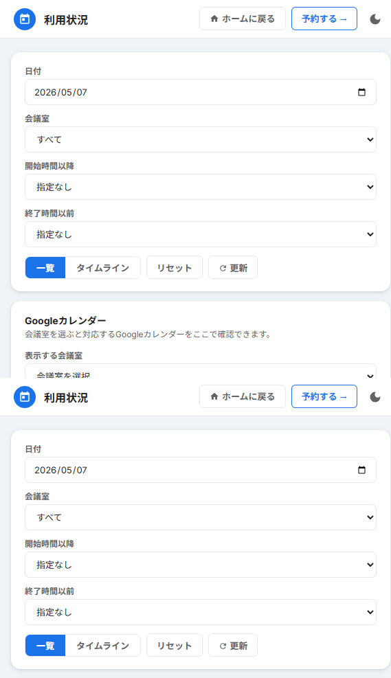
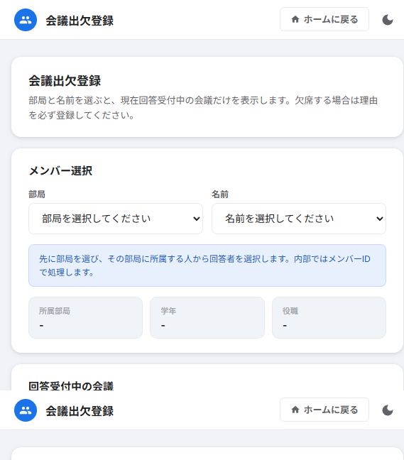
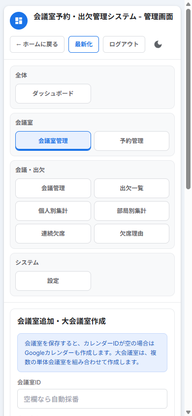
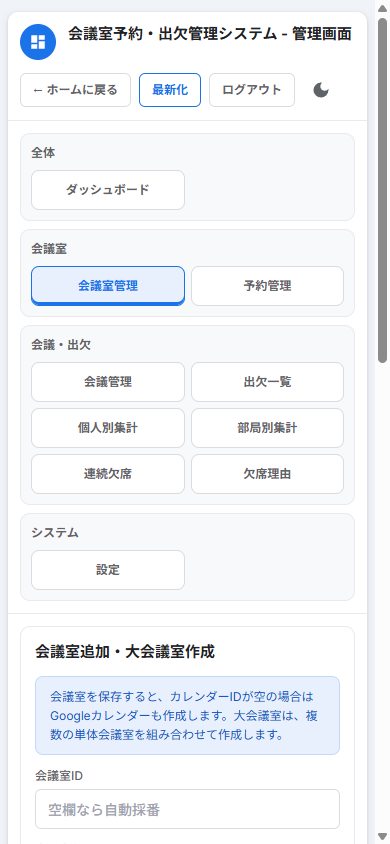

# 会議室予約・出欠管理システム 使いかた

この資料は、学生と運営担当者が実際に使う画面をもとにした説明です。  
ブラウザでシステムを開き、トップ画面から使いたい機能を選びます。

## 1. 画面の選び方

| 入口 | 使う場面 |
|---|---|
| 予約する | 会議室を新しく予約したいとき |
| 予約確認画面 | 予約済みの時間やGoogleカレンダーを見たいとき |
| 出欠登録画面 | 会議への出席・欠席を回答したいとき |
| 管理画面 | 運営担当者が会議室、会議、予約、設定を管理するとき |

学生が普段使うのは、主に `予約する`、`予約確認画面`、`出欠登録画面` です。

## 2. 会議室を予約する

`予約する` を開き、団体名、お名前、利用日、開始時間、終了時間、会議名を入力します。

時間を入力すると、使える会議室が表示されます。  
大会議室が登録されている場合は、通常の会議室と同じように選択できます。

予約前に確認すること:

| 確認する内容 | 理由 |
|---|---|
| 利用日 | 日付間違いを防ぐため |
| 開始時間・終了時間 | 他の予約と重ならないようにするため |
| 会議室 | 単体会議室か大会議室かを間違えないため |
| 会議名 | 利用状況画面で見分けやすくするため |

大会議室を予約すると、その大会議室を構成する各会議室も同じ時間に使用中として扱われます。  
そのため、大会議室と構成元の単体会議室を同じ時間に重ねて予約することはできません。

## 3. 予約状況を見る

`予約確認画面` では、日付や会議室で絞り込んで予約状況を確認できます。

見られる内容:

| 表示 | 内容 |
|---|---|
| 一覧 | 予約されている会議名、時間、会議室、団体名 |
| タイムライン | 時間帯ごとの予約状況 |
| Googleカレンダー | 会議室ごとのカレンダー |

大会議室の予約は、構成している会議室の利用状況にも反映されます。  
たとえば、`A室 + B室` の大会議室を予約した場合、A室とB室も同じ時間に使用中として表示されます。

## 4. 出欠を登録する

`出欠登録画面` を開き、自分の部局と名前を選びます。

名前を選ぶと、自分の情報と受付中の会議が表示されます。会議ごとに `出席` または `欠席` を選んで保存します。

欠席するとき:

| 状況 | 入力する内容 |
|---|---|
| 授業で欠席 | 欠席理由で `授業` を選ぶ |
| 体調不良で欠席 | 欠席理由で該当する理由を選ぶ |
| 選択肢にない理由 | `その他` を選び、詳細理由を書く |

`その他` を選んだ場合は、詳細理由を入力しないと保存できません。  
運営設定によっては、`授業` などを選んだ場合でも詳細理由が必要になることがあります。

## 5. 回答を変更する

受付期間内であれば、保存済みの回答を変更できます。

1. 出欠登録画面を開く。
2. 自分の部局と名前を選ぶ。
3. 対象の会議で回答を選び直す。
4. 保存する。

同じ会議に対して保存し直すと、前の回答が新しい回答に置き換わります。

## 6. 運営担当者: 会議室を追加する

管理画面の `会議室管理` で、会議室を追加できます。

入力する内容:

| 項目 | 内容 |
|---|---|
| 会議室ID | 空欄なら自動採番 |
| 会議室名 | 画面に表示する名前 |
| 会議室種別 | `単体` または `大会議室` |
| 表示順 | 画面での並び順 |
| 利用可能 | 予約画面に出すかどうか |
| カレンダーID | 空欄なら保存時にGoogleカレンダーを作成 |

カレンダーIDを空欄にして保存すると、その会議室用のGoogleカレンダーが作成され、会議室データに保存されます。

## 7. 運営担当者: 大会議室を作る

会議室種別で `大会議室` を選ぶと、構成会議室を選択できます。

大会議室の考え方:

| 予約するもの | 使用中になる会議室 |
|---|---|
| 単体会議室 | その会議室だけ |
| 大会議室 | 大会議室と、構成している各会議室 |

大会議室にも専用のGoogleカレンダーを作成します。  
大会議室を予約した場合は、大会議室用カレンダーと構成会議室それぞれのカレンダーに予定が登録されます。

## 8. 困ったとき

| 状況 | 対応 |
|---|---|
| 予約できない | 必須項目がすべて入力されているか確認する |
| 会議室が選べない | その時間に予約済み、または大会議室の構成上重複している可能性がある |
| 出欠を保存できない | 欠席理由や詳細理由が必要か確認する |
| 自分の名前が出ない | 部局の選択が合っているか確認する |
| 予約がすぐ表示されない | 数秒待ってから画面を更新する |
| カレンダーが表示されない | 会議室にカレンダーIDが設定されているか確認する |

